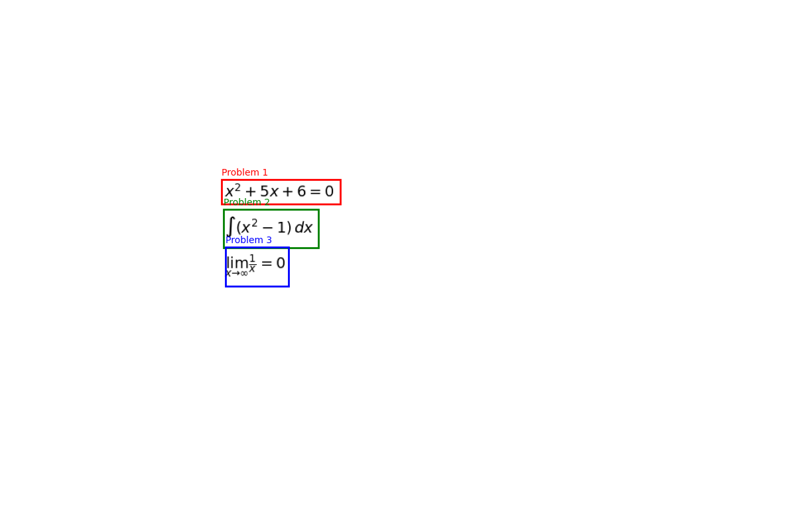

# MathScrape

A Python application for extracting and converting mathematical expressions from images to LaTeX format.

## Features

- Extracts mathematical expressions from images using OCR
- Converts recognized text to LaTeX format
- Supports various mathematical notations:
  - Quadratic equations (e.g., "x^2+5x+6=0")
  - Integrals (e.g., "∫(x^2-1)dx")
  - Limits (e.g., "lim_{x→∞} 1/x=0")
- Handles common OCR misrecognitions and formatting issues
- Visualizes detected math regions in the image

## Sample Output

Here's an example of MathScrape processing three different types of mathematical expressions:



### Detected Expressions and LaTeX Output:

1. Quadratic Equation
   - Text: x?+5x+6=0
   - LaTeX: x^2+5x+6=0

2. Integral
   - Text: J(x2-+1)dx
   - LaTeX: \int(x^{2}-1)\,dx

3. Limit
   - Text: lim(x--)1/x=0
   - LaTeX: \lim_{x \to \infty}\frac{1}{x}=0

The visualization shows how MathScrape detects and processes each expression, with different colors indicating separate mathematical problems.

## Requirements

### Python Environment
- Python 3.7+
- Conda environment recommended

### Core Dependencies
- OpenCV (cv2)
- Tesseract OCR
- pix2tex
- PyTorch
- NumPy
- Pillow (PIL)
- scikit-learn
- matplotlib

### Installation

1. Create and activate conda environment:
```bash
conda create -n mathscrape python=3.9
conda activate mathscrape
```

2. Install PyTorch (with CUDA if available):
```bash
# With CUDA
conda install pytorch torchvision torchaudio pytorch-cuda=11.8 -c pytorch -c nvidia
# CPU only
conda install pytorch torchvision torchaudio cpuonly -c pytorch
```

3. Install other dependencies:
```bash
pip install -r requirements.txt
```

4. Install Tesseract OCR:
- Windows: Download and install from [UB-Mannheim/tesseract](https://github.com/UB-Mannheim/tesseract/wiki)
- Other platforms: Follow [Tesseract installation guide](https://github.com/tesseract-ocr/tesseract)

## Usage

1. Run the application:
```bash
python mathscrape.py
```

2. Enter the path to your image when prompted

3. The application will:
   - Detect mathematical expressions in the image
   - Convert them to LaTeX format
   - Display the results
   - Generate a visualization of detected regions

## Example Output

Given an image with these mathematical expressions:
```
X^2 + 5x + 6 = 0
∫(x^2 - 1)dx
lim_{x→∞} 1/x = 0
```

The application outputs:
```
Region 1 - Text: X^2+5x+6=0
         LaTeX: {x}^{{2}}+5x+6=0

Region 2 - Text: Jx^2-1)ax
         LaTeX: \int({x}^{{2}}-1)\,d x

Region 3 - Text: lime=0
         LaTeX: \operatorname*{\lim}_{x\to\infty}{=}0
```

Debug visualizations are saved showing:
- Preprocessed image (debug_preprocessed.png)
- Detected lines (debug_lines.png)
- Grouped regions (debug_groups.png)

## Recent Improvements

- Enhanced differential notation handling (dx → \mathrm{d}x)
- Improved infinity symbol recognition in limits
- Better handling of squared terms (x? → x^2)
- Multiple preprocessing strategies for better OCR accuracy
- Enhanced confidence scoring for LaTeX validation
- Added comprehensive test suite
- Fixed common OCR misrecognition issues

## Testing

Run the test suite:
```bash
python test_mathscrape.py
```

The test suite includes:
- Text preprocessing tests
- Image processing tests
- LaTeX conversion tests
- End-to-end integration tests

## Contributing

Feel free to submit issues and enhancement requests!
